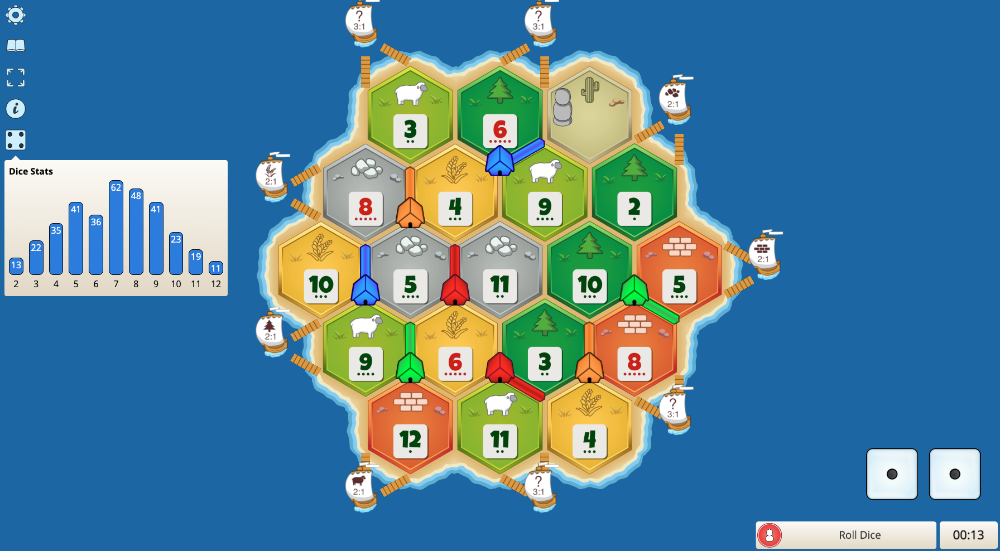

# Chrome Extension Boilerplate with SolidJS + Vite + TypeScript + Manifest V3

## Intro 
This extension is build for Colonist.io. It is a board game that is similar to the popular game Settlers of Catan. 
The extension is used to help players keep track of the dice rolls.
> The focus of this project is to create a Chrome Extension which implements feature requests from the game's community that are possible to be added by manipulating the DOM.

## Stack
- [SolidJS](https://www.solidjs.com/)
- [TypeScript](https://www.typescriptlang.org/)
- [Vite](https://vitejs.dev/)
- [ESLint](https://eslint.org/)
- [Chrome Extension Manifest Version 3](https://developer.chrome.com/docs/extensions/mv3/intro/)

## Installation 

### Procedures 
1. Clone this repository.
2. Run `npm i` (check your node version >= 16)
3. Run `npm run build`
4. Load Extension on Chrome
    1. Open - Chrome browser
    2. Access - chrome://extensions
    3. Check - Developer mode
    4. Find - Load unpacked extension
    5. Select - `dist` folder in this project (after dev or build)

## Screenshots 

